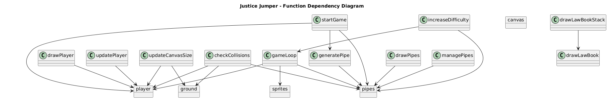

# ⚖ Justice Jumper

**Justice Jumper** is a Flappy Bird-inspired arcade game reimagined with a legal theme. Players take on the role of a young **law student** who must jump over obstacles (law books) to win cases and progress in their legal career. 📜✨

You can play it via this link: [⚖ Justice Jumper](https://alihaydarsucu.github.io/pixel-jumper/)

## 🌟 Features

- ⚖ **Legal-Themed Gameplay**: Jump through stacks of law books and avoid legal pitfalls.
- 🏛 **Justice-Themed UI**: The score represents "Cases Won," and the game over message is **"Case Dismissed!"**
- 🕹 **Simple Yet Challenging Controls**: Play with a single tap, click, Enter (to resume and restrat) or spacebar press.
- 🎨 **Retro Pixel-Art Design**: Inspired by classic arcade visuals with a courtroom touch.
- 🔊 **Sound Effects & Animations**: Featuring gavel hits, page flips, and legal-themed effects.

## 🛠 Technologies Used

- 🖥 **HTML5** (Canvas for rendering the game)
- ✨ **JavaScript** (Game logic and physics)
- 🎨 **CSS** (Styling and UI elements)

## 🚀 Installation

1. Clone this repository:
   ```sh
   git clone https://github.com/alihaydarsucu/justice-jumper.git
   ```
2. Navigate to the project directory:
   ```sh
   cd justice-jumper
   ```
3. Open `index.html` in your preferred browser to start playing.

## 🎯 How to Play

- 🏆 Click or press the **spacebar** to jump over law books and case files.
- 📜 Avoid hitting legal obstacles to keep your case alive.
- 🎯 Try to win as many cases as possible.
- ⏸ Press **ESC** to pause the game (**"Court Adjourned"** message will appear).

## 📐 Game Architecture

### 🔗 Function Dependency Map



### 📊 Function Call Flow

**Click to see:** [Function Call](Images/Diagrams/function_call_diagram.png)

### 🏛️ Project Structure

Here is our detailed project structure:

```lua
/justice-jumper
│-- index.html
│-- style.css
│-- script.js
│-- LICENSE
│-- README.md
│-- /images
│   │-- player0.png
│   │-- player1.png
│   │-- player2.png
│   │-- player3.png
│   │-- background.png
│   │-- ground.png
│-- /sounds
│   │-- jump.wav
│   │-- score.wav
│   │-- hit.wav
│   │-- die.wav
```

## 📜 License

This project is licensed under the **MIT License**. See the `LICENSE` file for more details.

## 🙌 Acknowledgments

Special thanks to the open-source community and game developers who inspire creative projects like **Justice Jumper!** 🎉

Enjoy jumping through the law! ⚖📚
